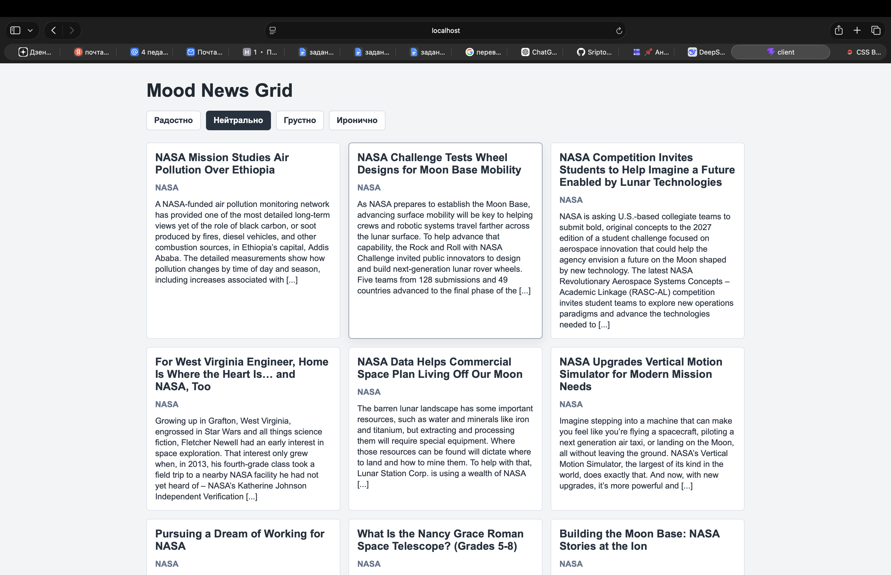
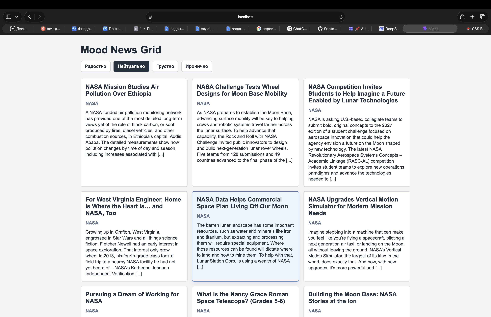
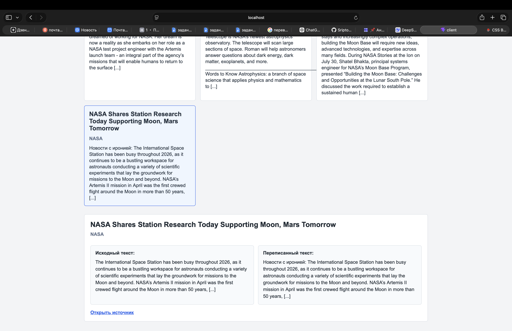

# Mood News Grid

Приложение показывает реальные новости NASA и позволяет читать
один и тот же текст в разных эмоциональных режимах: радостно,
нейтрально, грустно и иронично.

## Стек

- React + TypeScript + Vite
- Node.js + Express + TypeScript
- Sequelize
- SQLite

## Как запустить

Сервер:

```bash
cd server
npm install
npm run dev
```

Клиент:

```bash
cd client
npm install
npm run dev
```

Клиент открывается на адресе, который покажет Vite. Сервер
работает на `http://localhost:3001`

## Как загрузить новости

После запуска сервера выполнить:

```bash
curl -X POST http://localhost:3001/api/news/fetch
```

Новости будут сохранены в SQLite.

## Откуда берутся новости

Новости берутся из открытого NASA WordPress API:

https://www.nasa.gov/wp-json/wp/v2/posts

Сохраняются поля: id, title, source, url, publishedAt,
originalText и версии текста под разные настроения.

## Где хранятся данные

Данные хранятся в SQLite-файле:
server/storage/news.sqlite

## Как работает настроение

Исходный текст новости сохраняется без изменений. Для
эмоциональных режимов приложение добавляет тональную вводную фразу
к исходному тексту.

Так факты, имена, даты, числа, места и цитаты не переписываются и
не искажаются.

## Использование AI

AI использовался как помощник при разработке: для разбора ТЗ,
планирования шагов, проверки архитектуры и формулировки README.
Тексты новостей не генерировались вручную для каждой новости.

## Скриншоты




